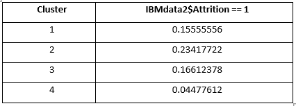
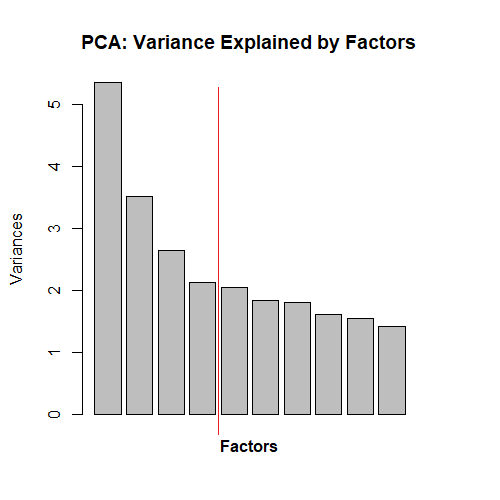
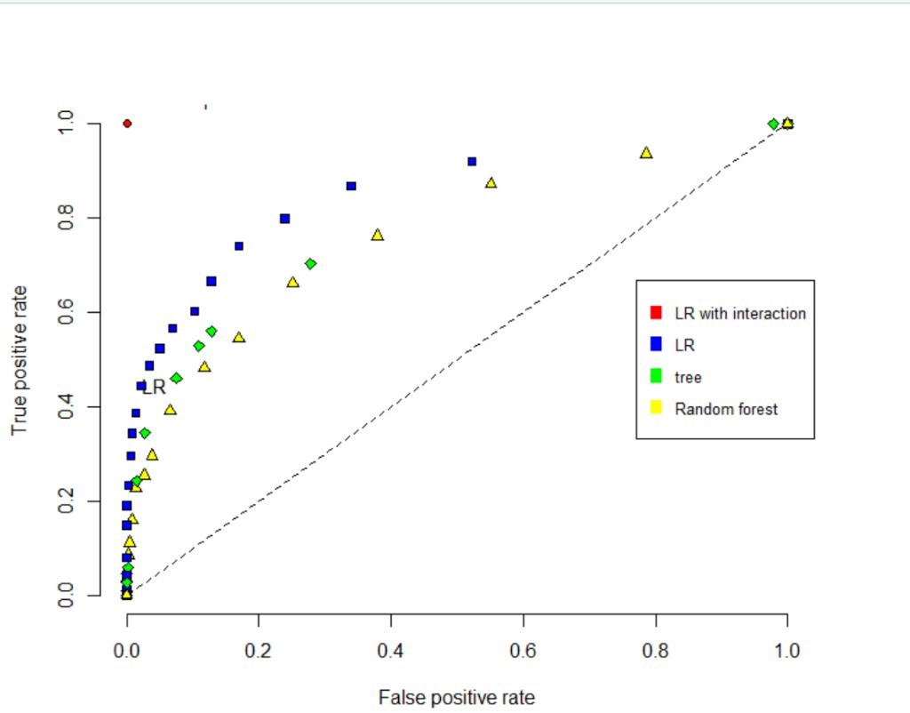

# IBM Attrition Prediction via Kaggle Dataset(People Analytics)

- Original R Script developed by: [Crystal Li](https://www.linkedin.com/in/jiawen-crystal-li/), [Sai Kiran Reddy](https://www.linkedin.com/in/saikiran1003/), [Keena Desai](https://www.linkedin.com/in/keena-desai-15849289/), [Ho Tai Peter Law](https://www.linkedin.com/in/ho-tai-peter-law-53262048/) (Myself), and [Yash Kanoongo](https://www.linkedin.com/in/yashkanoongo/)

- Team report and analysis is available on Medium via ["Predicting Factors for Employee Attrition in IBM"](https://medium.com/@yashkanoongo/ibm-attrition-81975347db14)

- The orginal fictional/simulated dataset can be found [here](https://www.kaggle.com/pavansubhasht/ibm-hr-analytics-attrition-dataset) via Kaggle

- Original code completed on: Oct 13, 2019

- Modified and re-ran by myself on: Aug 06, 2020

**Goal**

  - Finding/understanding demographic/profiling factors that would be highly predictive of an employee attrition/churn rate at IBM

**Exploratory Analysis & Data Preparation**

  - Converting “Attrition”, “OverTime” and “Gender” variables from Yes/No to binary
  - Removing given filtering variables that has the same value accross all rows (“Over18”, “Standard Hours” and “Employee Count”)
  - Splitting given dataset 80:20 for training and testing

  *Exploratory Matrix*

  

  *Wage v Attrition v Years at Work*

  

**Further Exploration with Unsupervised Learning**
  
  *K-Means*
  
  - Limited variation explained by the clusters 
  
  

  *PCA*

  - Limited variation explained by the significantly difference components 

  

  
 
*First PC*
  - JobLevel: -0.3799896     
  - MonthlyIncome: -0.3735956        
  - TotalWorkingYears:-0.3714327        
  - YearsAtCompany: -0.3376147

*Second PC*
  - Department_Research_&_Development: -0.5053750                         
  - Department_Sales: 0.4948894

*Third PC*
  - Department_Human_Resources: 0.5642543    
  - JobRole_Human_Resources: 0.5368867

*Forth PC*
  - MaritalStatus_Single: 0.6023669 
                       
                       
**Supervised learning**

- Null Model: AIC=1039
- Logistic Regression (Backward Selection) :  AIC=768.07
- Logistic Regression with interactions: AIC=1806

*R² as a performance evaluation metric*

*ROC curve*

  
